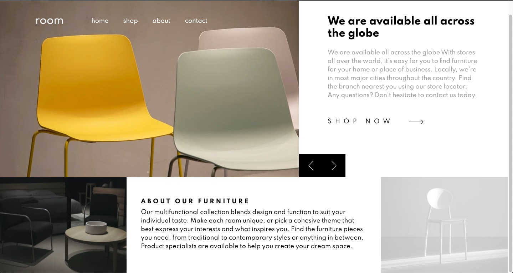

# Frontend Mentor - Room homepage solution

This is a solution to the [Room homepage challenge on Frontend Mentor](https://www.frontendmentor.io/challenges/room-homepage-BtdBY_ENq). Frontend Mentor challenges help you improve your coding skills by building realistic projects.

## Table of contents

- [Overview](#overview)
  - [The challenge](#the-challenge)
  - [Screenshot](#screenshot)
  - [Links](#links)
- [My process](#my-process)
  - [Built with](#built-with)
  - [What I learned](#what-i-learned)
  - [Continued development](#continued-development)
- [Author](#author)
- [Local Installation of Project](#installation)

## Overview

### The challenge

Users should be able to:

- View the optimal layout for the site depending on their device's screen size
- See hover states for all interactive elements on the page
- Navigate the slider using either their mouse/trackpad or keyboard

### Screenshot

### Links

- Solution URL: [Githun Repo](https://github.com/lucaspl3tti/room-homepage)
- Live Site URL: [Live Page](https://your-live-site-url.com)

## My process

### Built with

- Semantic HTML5 markup
- Mobile-first workflow
- Bootstrap5 Framework
- SCSS
- Flexbox
- CSS Grid
- Vanilla JavaScript

### What I learned

Got some new Knowledge on how to create a grid layout and how to dynamically build a slider in JavaScript.

### Continued development

To layout a grid is still a bit complicated for me, so in the future I wanna try to get a lot better at it.

## Author

- Website - [Jan-Luca Splettstößer](https://www.spletti.info)
- GitHub - [@lucaspl3tti](https://github.com/lucaspl3tti)
- Frontend Mentor - [@lucaspl3tti](https://www.frontendmentor.io/profile/lucaspl3tti)

## Local Installation
1. Clone the repo with `git clone https://github.com/lucaspl3tti/<Repo Path>.git` to your desktop
   * use `git clone git@github.com:lucaspl3tti/<Repo Path>.git` if you are using git with ssh
2. Run an installation of the package dependencies using `npm i`

### Commands
`npm run dev` run this command to build the app in dev mode and initialize a dev server with hot reload.

`npm run build` run this command to simply build the app in dev mode

`npm run prod` run this command to build the app in production mode

`npm run lint:scss` run this command to lint over all scss files

`npm run lint:js` run this command to lint over all js files
